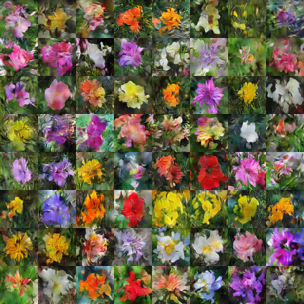

# Paddle_T2I
Generative Adversarial Text to Image Synthesis 论文复现
# Dataset
we use the Oxford-102 datatset that provided in [text-to-image-synthesis](https://github.com/aelnouby/Text-to-Image-Synthesis).
Download the data to ```Data\```
# Training
```
python main.py
```
# Test
```
python main.py --validation
```
# Results
Dataset | Paddle_T2I | Text_to_Image_Synthesis
:------:|:----------:|:------------------------:|
[Oxford-102]|<br/>|<br/>|
