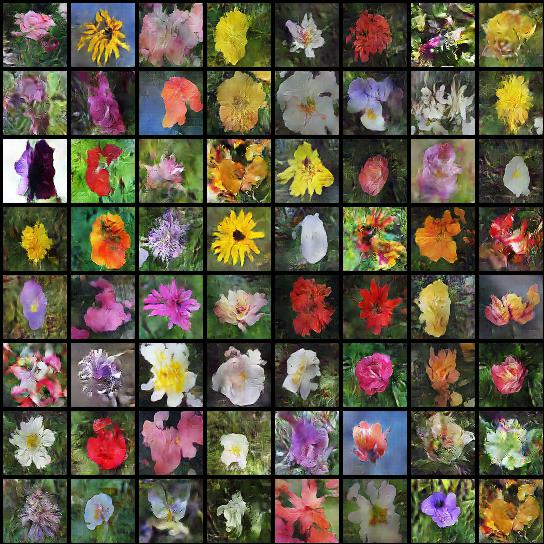

# Paddle_T2I
Generative Adversarial Text to Image Synthesis 论文复现
# Dataset
我们使用的是 [Oxford-102](https://drive.google.com/open?id=1EgnaTrlHGaqK5CCgHKLclZMT_AMSTyh8) 数据集，这个数据集是由 [text-to-image-synthesis](https://github.com/aelnouby/Text-to-Image-Synthesis)项目提供的。为了更快地进行读取，数据集被转换成了hd5格式。数据集下载下来后保存在： ```Data\```   
如果想要自行转换数据格式，可按照如下步骤操作：  

# Training
```
python main.py
```
# Test
```
python main.py --validation
```
# Log
```
visualdl --logdir Log --port 8080
```
# Results
Dataset | Paddle_T2I | Text_to_Image_Synthesis
:------:|:----------:|:------------------------:|
[Oxford-102]|<br/>|<br/>|
